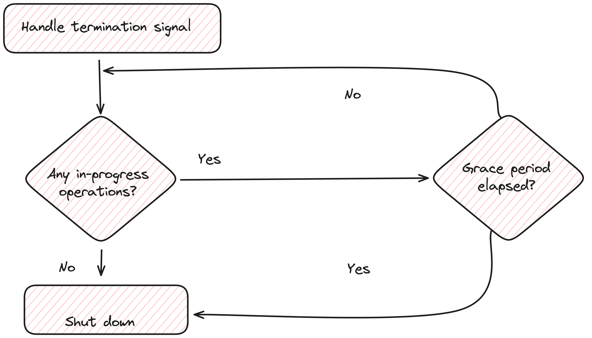

# graceful-shutdown
[https://medium.com/gitconnected/graceful-shutdown-why-it-matters-and-how-to-implement-it-919e741b397e](https://medium.com/gitconnected/graceful-shutdown-why-it-matters-and-how-to-implement-it-919e741b397e)

## The idea of a graceful shutdown
A graceful shutdown is the process of shutting down a system, application, or service in a manner that allows it to complete its current tasks, release resources properly, and save its state, thereby minimizing disruption and data loss.

